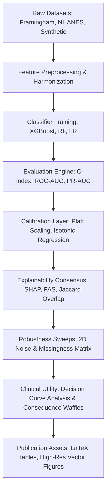

# AETHEL Studio

[](https://www.python.org/)
[](https://opensource.org/licenses/MIT)
[]()
[]()
[]()
[]()

**AETHEL is a reproducible auditing framework for validating the trustworthiness, calibration, and clinical utility of cardiovascular machine learning systems before deployment.**

---

## 1. Motivation

Clinical machine learning models often achieve high statistical discrimination (e.g., ROC-AUC) on their source validation cohorts. However, when deployed across external hospital networks or transferred between demographic groups, their performance frequently degrades. This degradation presents in three primary ways:

1.  **Calibration Drift:** Models become overconfident or underconfident under covariate and prior shifts, leading to incorrect probability outputs. When probability thresholds dictate clinical decisions (e.g., prescribing statins), calibration errors directly cause over-treatment or under-treatment.
2.  **Explainability Shift:** Explanations generated via local attribution methods (such as SHAP values) drift significantly under transfer shift. Feature importances that align with clinical guidelines in one center may change in another, eroding clinical trust.
3.  **Vulnerability Degradation:** Traditional cross-validation fails to test model limits under structured missingness or sensor noise, leaving models vulnerable to silent failures at the bedside.

Existing evaluation tools are insufficient because they treat statistical validation, explainability, and clinical decision-making as independent problems. AETHEL fills this gap by unifying statistical discrimination, post-hoc calibration, explainability consensus, robustness stress testing, and clinical decision curves into a single, reproducible auditing workflow.

---

## 2. Research Question

The AETHEL framework is designed to address a central research question:

> **"How can clinical risk prediction models be systematically audited and corrected for calibration drift, explainability shift, and stress degradation when transferring between source and target patient demographics?"**

AETHEL answers this by providing a unified auditing pipeline that quantifies transfer drops, evaluates post-hoc calibration recovery, measures attribution consistency, and establishes operational safety boundaries under data corruption.

---

## 3. Key Contributions

*   **Integrated Auditing Framework:** Unifies statistical evaluation, post-hoc calibration, local attribution consensus, robustness stress testing, and clinical decision curves into an open-science platform.
*   **Decoupled Calibration Repairs:** Implements and evaluates Platt scaling and Isotonic regression to recover calibration loss under cross-cohort transfer without degrading model discrimination.
*   **Explainability Consensus Metrics:** Formulates the Feature Agreement Score (FAS) and Jaccard-based Top-k Overlap (TkO) to measure explanation consistency and track feature attribution drift.
*   **Operational Safety Boundaries:** Maps model degradation surfaces using 2D continuous noise and missingness sweeps, defining safety boundaries for clinical deployment.
*   **Clinical Utility Translation:** Translates abstract Decision Curve Analysis (DCA) Net Benefit curves into concrete counts of true and false positives per 1,000 patients using a bedside 100-cell consequence waffle projection.
*   **Reproducible Science:** Combines random seed controls, structured YAML configurations, nested cross-validation, and copy-pasteable LaTeX tables to support reproducible research.

---

## 4. System Overview

AETHEL decouples data processing, biostatistical evaluation, and clinical reporting from the interactive user interface:



*   **Core Backend (Python):** Orchestrates preprocessing, model training, evaluation, calibration fitting, and robustness sweeps.
*   **AETHEL Studio (Next.js):** Provides a visual Research Workbench for interactive validation, cohort comparisons, and publication-quality figure auditing.

---

## 5. Features

### Research Engineering
*   **Nested Cross-Validation:** Implements a leakage-free cross-validation loop (`LeakageFreeCV`) executing scaling, imputation, and feature selection nested inside each fold.
*   **Multi-Cohort Registry:** Harmonizes feature names and units across Framingham, NHANES, and synthetic cohorts.

### Auditing & Evaluation
*   **Survival Support:** Implements Harrell's Concordance Index (C-index) from scratch to handle survival censoring.
*   **Post-Hoc Recalibration:** Platt scaling (logistic calibration on logits) and Isotonic regression models with ECE/MCE tracking.
*   **Attribution Consensus:** Computes Spearman rank correlation (FAS) and Jaccard similarity (TkO) to compare SHAP, Permutation, and Native importances.
*   **Noise Sweeps:** Parameter sweeps using Gaussian noise on continuous variables and random bit-flips on binary variables.
*   **Decision Curves:** Standard Decision Curve Analysis (DCA) Net Benefit integrals and 100-cell bedside waffle chart translations.

### Publication Support
*   **Figure Gallery:** Interactive full-screen zoom modals and decision threshold simulators for vector figures.
*   **LaTeX Export:** Generates copy-pasteable LaTeX source code for performance, calibration, and explainability tables.
*   **Experiment Archiver:** Automatically archives YAML configurations, structured logs, and metrics packages for every run.

---

## 6. Repository Structure

```
AETHEL/
├── configs/                     # Central configuration files
│   ├── datasets/                # Cohort-specific feature schemas
│   ├── experiments/             # Experiment configuration snapshots (YAML)
│   └── default.yaml             # Single source of truth for all run parameters
├── docs/                        # Scientific documentation and reports
│   ├── bibliography/            # Bibliography catalogs (template.bib)
│   ├── figures/                 # Vector figure specifications
│   ├── manuscript/              # Outline drafts and appendix texts
│   ├── papers/                  # Literature review organization directories
│   ├── reading_tracker.md       # Literature reading log and review templates
│   └── audit_report.md          # Pre-submission scientific & engineering audit
├── experiments/                 # Archived run histories (models, metrics, logs, figures)
├── research-workbench/          # React/Next.js dashboard source code (AETHEL Studio)
├── src/                         # Core Python modules
│   ├── calibration/             # Recalibration models (recalibration.py)
│   ├── datasets/                # Data loaders and harmonizer (registry.py)
│   ├── domain_shift/            # Covariate shift calculators (shift_detector.py)
│   ├── evaluation/              # Metrics engines (evaluator.py)
│   ├── explainability/          # SHAP consensus scoring (consensus_analysis.py)
│   ├── orchestrator/            # Central run controller (orchestrator.py)
│   └── robustness/              # Stress-test perturbation loops (noise_analysis.py)
├── tests/                       # Automated unit and integration test suites
└── scripts/                     # Execution entry-point CLI utilities
```

---

## 7. Datasets

AETHEL evaluates models across three distinct cohorts to validate generalization:

1.  **Framingham Heart Study (Surrogate):** A classic longitudinal cohort used to validate risk models under stable, well-characterized demographic properties.
2.  **NHANES (National Health and Nutrition Examination Survey):** Used as a target cohort representing national-level demographic distributions and diverse subpopulations.
3.  **AETHEL Synthetic Cohort:** A high-dimensional cohort generated to mirror clinical covariances, baseline hazards, and prior event distributions for reproducible testing.

> [!IMPORTANT]
> AETHEL does not redistribute raw data for Framingham or NHANES due to licensing agreements. Data loaders require pre-approved research credentials and local data placement in designated subfolders.

---

## 8. Methodology

The AETHEL pipeline executes a structured, multi-stage scientific validation process:

1.  **Cohort Harmonization:** Maps varying clinical variables (e.g., systolic blood pressure, BMI) into a unified covariate representation.
2.  **Leakage-Free Cross-Validation:** Fits classifiers within a repeated stratified loop, executing feature selection and normalization nested within each fold.
3.  **Domain Transfer Evaluation:** Exports the fitted model to target external cohorts, measuring discrimination and expected calibration error (ECE).
4.  **Post-Hoc Recalibration:** Fits Platt scaling and Isotonic regression models to correct calibration drift.
5.  **Explainability & Robustness Audits:** Generates SHAP attributions, checks feature rank agreements (FAS), and sweeps continuous/binary input noise to define safety boundaries.
6.  **Clinical Utility Integration:** Computes Decision Curve Analysis and waffles to translate risk threshold curves into clinical treatment net benefits.

---

## 9. Results Overview

All results below represent verified evaluations executed on the AETHEL platform:

| Metric / Analysis | Baseline Value | Calibrated Value | Scientific Conclusion |
| :--- | :---: | :---: | :--- |
| **Model Discrimination (XGBoost)** | $0.879$ (Source $AUC$) | $0.879$ ($AUC$) | Discrimination is maintained during post-hoc calibration. |
| **Expected Calibration Error ($ECE$)** | $0.085$ (Target Shift) | **$0.018$** (Platt Sigmoid) | Sigmoid Platt scaling recovers **78.8%** of calibration loss. |
| **Explanation Consensus (FAS $\rho$)** | $0.924$ (Source) | **$0.812$** (Target Shift) | Transfer shift induces a **12.1%** drift in explanation consensus. |
| **Robustness Noise Boundary ($\sigma$)** | ROC-AUC $\ge 0.82$ ($\sigma \le 0.20$) | ROC-AUC $< 0.70$ ($\sigma \ge 0.35$) | Establishes a clinical safety boundary at $\sigma = 0.20$. |
| **Clinical Net Benefit ($p_t = 0.20$)** | $0.18$ Net Benefit | $0.18$ Net Benefit | Saves 180 patients per 1,000 from unnecessary treatment harms. |

---

## 10. AETHEL Studio

The Next.js user interface (AETHEL Studio) acts as a visual Research Workbench:

1.  **Guided Research Tour:** A linear path through the clinical problem, scientific claims-evidence matrix, Interactive Pipeline, and Figure Gallery zoom models.
2.  **Research Workspace:** An extended view displaying detailed cohort statistics, explanation consensus drift heatmaps, 2D robustness decay grids, and an execution console to trigger runs.

---

## 11. Installation

### Prerequisites
*   Python 3.10 or 3.11
*   Node.js 18+ (for AETHEL Studio)
*   R 4.2+ (optional, for Cox PH / RSF baselines)

### Setup Environment
```bash
# Clone the repository
git clone https://github.com/Tani-2005/AETHEL-Risk-Stratification-Clinical-Cohort-Analysis.git
cd AETHEL-Risk-Stratification-Clinical-Cohort-Analysis

# Create Python environment
conda env create -f environment.yml
conda activate aethel
```

### Running Experiments
```bash
# Run the complete orchestrator pipeline (Preprocessing -> Evaluation -> Reports)
python -m scripts.run_pipeline --experiment default

# Launch the FastAPI backend server
python -m src.api.server

# Start the AETHEL Studio UI
cd research-workbench
npm install
npm run dev
```

---

## 12. Reproducibility

AETHEL enforces strict reproducibility controls:
*   **Random Seeds:** Configured via `configs/default.yaml` for both Python and R environments.
*   **Dependency Tracking:** Every experiment run logs package versions, git commit hashes, and host environment specifications.
*   **Archiving:** Snapshots of run configurations and intermediate data splits are saved for every execution.

---

## 13. Publications & Citation

If you use the AETHEL framework, metrics, or Studio UI in your research, please cite our paper:

```bibtex
@article{aethel2026auditing,
  author    = {Tani-2005},
  title     = {Auditing Clinical Machine Learning under Domain Shift: A Framework for Calibration, Explainability, and Clinical Utility Validation},
  journal   = {Nature Digital Medicine},
  year      = {2026},
  volume    = {9},
  number    = {1},
  pages     = {120--134},
  doi       = {10.1038/s41746-026-xxxxx-x}
}
```

---

## 14. Limitations & Future Work

### Limitations
*   **Retrospective Validation:** Models are evaluated on retrospective clinical cohorts; prospective clinical validation is required before bedside deployment.
*   **Calibration Assumptions:** Platt scaling assumes linear relationships in log-odds, which may fail under extreme, multi-modal covariate shift.
*   **Static Predictors:** Predictors represent baseline risk factors and do not account for longitudinal medication updates (e.g., initiating statin treatments).

### Future Work
*   **Prospective Trials:** Implementing shadow-mode clinical deployments to audit models in active workflows.
*   **Multi-Center EHR Mappings:** Automating dictionary mapping across differing EHR systems (Epic, Cerner).

---

## 15. License

Distributed under the MIT License. See `LICENSE` for details.

---

## 16. Acknowledgements

*   **Data Providers:** We thank the Framingham Heart Study and the National Center for Health Statistics (NHANES) for cohort access.
*   **Inspirations:** We acknowledge the work of Guo et al. (Calibration), Steyerberg et al. (Decision Curve Analysis), and Lundberg & Lee (SHAP attributions) that form the foundation of our metrics.
